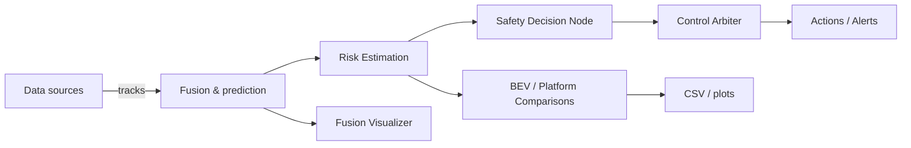

# risk_assesment (module)

This README documents the Python modules inside the `risk_assesment` package and provides a flow diagram showing runtime interactions.

## Module files & purpose

- `__init__.py` — Package initializer.
- `bev_comparison.py` — Generate BEV comparison plots and metrics across methods or datasets.
- `control_arbiter.py` — Arbitration layer to choose the final control action when multiple decision sources produce candidates.
- `fusion_visualizer.py` — Tools to visualize fused pedestrian tracks and risk scores (Matplotlib/RViz helpers).
- `plat_comparison_graph.py` — Create performance comparison graphs (latency, false positives, risk curves) for benchmarking.
- `safety_decision_node.py` — Core safety decision logic: inputs tracked pedestrian states and outputs recommended safe actions or alerts.
- `safety_decision_node_ema_lstm.py` — EMA + LSTM based variant for smoothing and short-term prediction before decision logic.
- `processed_pedestrian_data.npz` — Example dataset used for offline testing and plotting.
- `realtime_comparison_fixed.csv` — Example benchmark CSV for reference.

## Typical execution flow



## How to run

Run scripts directly for offline analysis and plotting:

```bash
python -m risk_assesment.plat_comparison_graph
python -m risk_assesment.bev_comparison
```

For real-time operation, run the appropriate decision node(s) and connect their inputs to your tracker/fusion topics. Use `control_arbiter.py` to harmonize outputs when multiple agents or decision modules are present.

## Parameters & config

- Each script accepts configuration via command-line flags or Python constants at the top of the file. For ROS integration, adapt the parameter loading to ROS parameters or provide a small wrapper node.

## Notes

- `safety_decision_node_ema_lstm.py` requires a trained LSTM model file if used — check the top of that file for model path parameters.
- Example data files (`processed_pedestrian_data.npz`) are included for reproducible offline runs.
